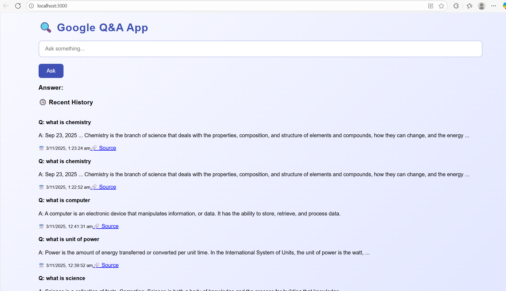

# 🌐 Google Q&A App

A simple full-stack Question & Answer web app built using **React**, **Node.js**, **Express**, and **MongoDB**.

---

## 📂 Project Structure

Google-QA-App/
┣ backend/
┃ ┣ models/
┃ ┗ server.js
┣ frontend/
┃ ┗ src/
┣ .env
┗ README.md

---

## 🚀 Features

- 🔐 **Secure backend** using Express & Mongoose
- 💬 **Ask and answer questions** easily
- 📄 **frontend** built with React
- ⚙️ **RESTful APIs** for smooth communication
- 🧩 Modular folder structure (backend & frontend separated)
- ☁️ MongoDB integration for storing Q&A data

---

## 🛠️ Tech Stack

| Area | Technology |
|------|-------------|
| Frontend | React.js, Axios, CSS |
| Backend | Node.js, Express.js |
| Database | MongoDB, Mongoose |
| Version Control | Git & GitHub |
| Environment | .env for API keys and secrets |

---

## ⚙️ Installation & Setup
🔹 Step 1: Clone this repository
    git clone https://github.com/praveen610409/Google-Q-A-app.git
    cd Google-Q-A-app

🔹 Step 2: Setup Backend
    cd backend
    npm install
    node server.js

📡 Server will run on http://localhost:5000

🔹 Step 3: Setup Frontend
    cd ../frontend
    npm install
    npm start

    💻 React app will start on http://localhost:3000

### 🧠 Environment Variables (.env)

Create a .env file inside the backend/ folder and add:

MONGO_URI=your_mongodb_connection_string
PORT=5000

### 📸 Screenshots

---

### 👨‍💻 Author
    Praveen Singh
